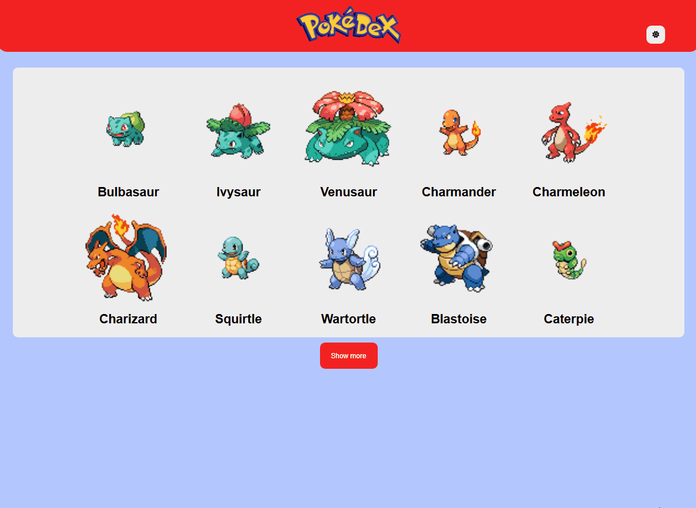

# Pokémon Pokédex

This project allows the user to view Pokémon, their types, abilities, and moves.

## Glossary

- [Overview](#overview)
  - [About](#about)
  - [Screenshots](#screenshots)
- [How to Run the Project](#how-to-run-the-project)
- [My process](#my-process)
  - [Challenges and learnings](#challenges-and-learnings)
  - [Developed with](#developed-with)
- [Autor](#autor)

## Overview

### About

The purpose of this website is to display Pokémon to users and, when a Pokémon is selected, show its type, abilities, and moves. The site also features a theme-switching functionality, allowing users to toggle between light and dark modes.

### Screenshots

#### Example of the website


## How to Run the Project

To run the project locally, follow these steps:

1. Clone the repository:
   ```bash
   git clone "https://github.com/itsdavss/pokedex.git"

2. Navigate to the project folder:
   ```bash
   cd pokedex

3. Install the dependencies:
   ```bash
   npm install

4. Start the development server:
   ```bash
   npm run dev


## My process

This project was developed as part of the DevQuest course. We were given the necessary functionalities for the site and were free to design it in a way that best suited our preferences. On the site, we used the PokéAPI to fetch Pokémon data. I used React Router Dom to create a SPA (Single Page Application) as requested. I styled the entire site with Styled Components because I believe it was the best way to do it. The Context API was also used to create the context-based styles.

### Challenges and learnings

This was the most difficult project I've worked on so far. I am still consolidating everything I've learned about React, and I believe that by developing this project, I was able to understand better how React works.

### Developed with

- React
- Context API
- React Router
- Styled Components
- Font Awesome
- PokéAPI

## Autor

- GitHub - [itsdavss](https://github.com/itsdavss)
- My portfolio - [Davi Oliveira](https://itsdavss.github.io/portfolio-davi/)
- LinkedIn - [Davi Oliveira dos Santos](https://www.linkedin.com/in/davi-oliveira-dos-santos/)
